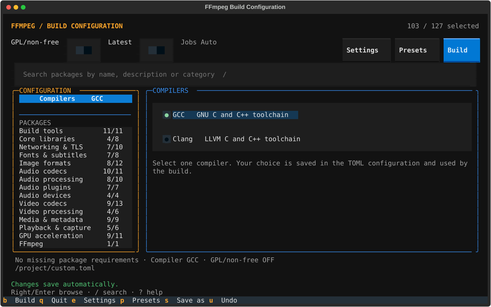

# FFmpeg Build Script

A safety-focused, state-pinned FFmpeg source build for modern Debian and Ubuntu
systems. It builds a broad multimedia dependency stack into an isolated
workspace, configures FFmpeg from the latest stable release, installs FFmpeg
under `/usr/local`, and validates the installed binaries before marking the
build complete.

The project favors static dependency archives, but the final binary can still
link dynamically to selected operating-system libraries and GPU runtimes.

## Major update: 8.0.0

- The builder and diagnostic tools are now Python. The entry point is
  `build-ffmpeg.py`; the Bash scripts have been removed.
- `--menu` edits all 127 package choices, checks dependencies, saves a TOML
  configuration, and launches the build. Its Textual interface saves compiler
  and package choices immediately, with mouse and keyboard navigation.
- Python 3.12 or newer is required. Command-line builds use the standard
  library. The interactive menu uses Textual; development tools are optional.
- Compatible 6.0.0 and 7.0.0 workspaces retain their built dependencies and
  reconfigure FFmpeg. Changed compiler flags or package selections still
  require cleanup. The build-context format remains v2.
- Native build processes receive a clean environment so Conda's libraries,
  compilers, and package search paths cannot override the build toolchain.
  After host setup, the log reports the selected C and C++ compiler version
  banners and executable paths, using the same build environment as the recipes.
- FFmpeg retains its archive checks, release-dependent Vulkan integration,
  staged installation, and feature validation. Failed promotion or installed
  validation restores the previous programs and preserves recovery files.

## Requirements and supported hosts

- x86_64
- Debian 12 and 13
- Ubuntu 22.04, 24.04, and 26.04
- Any Ubuntu derivative declaring `ID_LIKE=ubuntu` whose `UBUNTU_CODENAME`
  is `jammy`, `noble`, or `resolute` (Linux Mint and Zorin among them)
- WSL2 using a supported Debian or Ubuntu userspace (WSL1 is not supported;
  convert with `wsl.exe --set-version <distro> 2`)

**Python 3.12, 3.13, and 3.14 are supported.** Ubuntu 22.04's default
Python 3.10 and Debian 12's default Python 3.11 cannot run the builder. Install
Miniconda under `~/miniconda3` to use the launcher-managed environment, or
launch with an installed Python 3.12 or newer interpreter.

When `~/miniconda3` exists, the launcher prefers its `install-ffmpeg`
environment. If that environment is missing, it asks before creating it with
Python 3.12, Textual and the optional development tools. Declining, or running
without an interactive terminal, uses an available compatible Python instead.
No environment is created without consent. The menu needs an interactive
terminal and Textual 8.2.8 or newer. Existing environments can install the menu
dependency with `~/miniconda3/envs/install-ffmpeg/bin/python -m pip install '.[menu]'`
from this checkout. A missing dependency produces an installation command for
the selected interpreter; ordinary builds do not import or require Textual.

Run the script as a normal user with working `sudo` access. Do not run the
entire script as root. The build also requires an internet connection and enough
free disk space for downloaded sources, intermediate objects, and installed
dependencies. Missing host build packages are installed with APT. On Ubuntu,
many optional feature packages come from the `universe` component, which is
enabled by default on standard images but may be absent from minimal ones
(`sudo add-apt-repository universe`).

## Quick start

```bash
git clone https://github.com/slyfox1186/ffmpeg-build-script.git
cd ffmpeg-build-script

# Keep the tracked template unchanged; edit the ignored working copy.
cp -- example.toml custom.toml

# Default LGPL-compatible build.
python3 build-ffmpeg.py --build --config ./custom.toml

# Or explicitly opt into GPL and non-free components.
python3 build-ffmpeg.py --build \
  --enable-gpl-and-non-free \
  --config ./custom.toml
```

`custom.toml` is the working configuration name used throughout this guide and
is ignored by Git. The tracked [example.toml](./example.toml) remains the
complete starting template.

The first build can take a long time and use substantial CPU, memory, and disk
space. Restrict parallelism on smaller machines:

```bash
python3 build-ffmpeg.py --build --jobs 8 --config ./custom.toml
```

## Command-line interface

```text

FFmpeg Build Script 8.0.0
Usage: build-ffmpeg.py [options]

Actions:
  -b, --build                       Build and install FFmpeg
  -c, --cleanup                     Remove this project's build root
  -m, --menu                        Choose packages in an interactive menu

Options:
  -h, --help                        Show this help without changing the filesystem
  -v, --version                     Show the script version
      --compiler <gcc|clang>        Override the config compiler (default: gcc)
      --gcc / --clang               Aliases for --compiler gcc / --compiler clang
      --config <path>               Load build/package choices from TOML
  -j, --jobs <count>                Set parallel build jobs (default: available CPUs)
  -l, --latest                      Refresh and rebuild outdated dependencies
  -n, --enable-gpl-and-non-free     Enable GPL/non-free components

Long options also accept --option=value (for example: --jobs=8).

Environment:
  BUILD_ROOT=/path                  Override the default ./build directory
  CUDA_INSTALL=ask|always|never     Control CUDA toolkit installation (default: ask)
  CUDA_ARCH_MODE=native|all|custom  Select CUDA code-generation targets
  CUDA_ARCHITECTURES="86 89"        Targets for CUDA_ARCH_MODE=custom
  FFMPEG_BUILD_DEBUG=ON             Stream commands while also logging them

Example:
  python3 build-ffmpeg.py --build --compiler clang --jobs 8 --config ./custom.toml
  python3 build-ffmpeg.py --build --latest --enable-gpl-and-non-free


```

`--help` and `--version` are side-effect free: they do not create a build
directory, truncate a log, request sudo, or load a config file.

The result is tuned for the machine that built it (`-march=native`,
`--cpu=native`, and AVX-512 detection), so the installed binaries may fault with
an illegal instruction on a different CPU. Build on the machine that will run
it, or remove those flags before building for distribution.

With no action, the script prints help. `--build`, `--cleanup`, and `--menu`
are mutually exclusive. A build without `--config` selects every registered
package; using the reviewed `custom.toml` allowlist is the recommended path.

Bare invocation, help and version reporting do not resolve or create an
interpreter environment. An incompatible existing Conda interpreter falls back
to the compatible system-interpreter search. Numeric settings accept ASCII
decimal digits; jobs, timeouts and counters are bounded to 2,147,483,647, while
byte limits may use the host's signed integer range. Empty environment timeout
overrides use the documented defaults.

Arguments are validated before any config file is read, so an invalid request
never applies a package selection. A relative `--config` path resolves against
the directory you ran the script from, never against the script's own
directory.

## Interactive menu



```bash
python3 build-ffmpeg.py --menu
python3 build-ffmpeg.py --menu --config ./custom.toml
```

The menu reopens `custom.toml` in the invocation directory when it exists;
otherwise it starts from the portable template. `--config` selects a specific
file instead. Existing compiler, GPL/latest and package choices are preserved,
and invalid existing configs fail explicitly before editing. The menu opens on
**Compilers**, with **GCC** and **Clang** as visible choices. Select one with
Space or Enter; radio markers show the active compiler. A horizontal divider
separates Compilers from the package categories. In the wide view, Compilers
stays visible while the package categories scroll below it.

All 127 packages are grouped into 15 types. The Textual interface provides
scrolling lists, compiler radio buttons, GPL/latest switches, mouse selection,
search, and visible keyboard focus. Large terminals show categories and options
side by side. Narrow or short terminals show one pane at a time, with the same
navigation keys. The compiler category stays above a divider while packages
scroll beneath it. Counts include packages only.

| Key | Action |
| --- | --- |
| Up/down | Navigate the focused list; `k`/`j` also navigate the category list |
| Space or Enter | Select a compiler or toggle a package, then return to categories; Enter opens a category |
| Right | Focus the current category's options |
| Left / Escape / Backspace | Return to categories without changing a selection; stay there if already focused on a category |
| Tab / Shift-Tab | Move between controls |
| `a` / `d` | Enable or disable the entire package category, including hidden search matches |
| `/` | Focus live search by package name, description or category |
| `D` / `?` | Open full details or keyboard help |
| `p` | Choose template, all, minimal or none preset |
| `u` | Undo up to 50 package, category, preset, compiler, GPL or latest changes |
| `c` | Open the Compilers category |
| `g` / `l` | Toggle GPL/non-free authorization or latest mode |
| `f` / `F` | Enable requirements for the current package or all packages |
| `e` | Edit jobs, CUDA installation/targets and build root for this session |
| `s` | Save as; subsequent edits auto-save to the chosen file |
| `i` | Import a TOML file into the current configuration; undo with `u` |
| `b` | Validate, save and build using the current configuration |
| `q` | Quit immediately; changes are already saved |
| Ctrl+C / Ctrl+D / Ctrl+Q | Exit from any screen |

Package toggles, compiler and GPL/latest choices, category changes, presets,
dependency fixes and undo **save immediately** to the active TOML file. Each
write is atomic. If it fails, the attempted change is reverted and an error is
displayed, preserving the saved configuration and undo history. Saving allows
unfinished package selections; Build checks requirements before starting.
Browsing and searching do not rewrite the configuration.

Search updates while typing. Enter or Escape returns focus to categories and
keeps the filter; clear the text to show all packages. Arrow and Backspace keys
edit text normally inside input fields. Dialogs close with Escape, and launch
settings are validated before Apply accepts them. Invalid jobs, CUDA targets or
unsafe build roots retain the last accepted launch settings. Relative save/import
paths resolve from the invocation directory, and `~` expands in file and build paths.

In Save as, Up/Down switches between the path field and the Cancel/Save buttons.
Left/Right moves the text cursor in the path field or selects a button in the
button row. Returning to the buttons restores the last focused button; Enter
activates it. Tab and Shift+Tab also move between controls.

The Import button or `i` opens a file-path dialog with the same keyboard controls.
Import replaces all package selections and persistent build settings (compiler,
GPL/non-free and latest), then saves to the current autosave destination. Omitted
packages are disabled, just as with `--config`. Session-only launch settings stay
in place. Import validates the complete file before applying anything; read or
validation errors leave the current configuration untouched, and a failed autosave
rolls back the import. Press `u` to undo a successful import. The source file does
not become the autosave destination; use Save as to change that destination.

The minimal preset includes build tools and FFmpeg.

Textual handles terminal input and restores keyboard modes on exit. On terminals
supporting the Kitty keyboard protocol, Escape has an unambiguous encoding; older
terminals use Textual's legacy input handling. Ghostty and Kitty support the
extended protocol, but neither is required. The menu does not install its own
Escape timeout or require a second press. It runs `clear` after the terminal is
restored, including when a build starts or the menu exits through an error.

The saved `[build]` table contains `compiler`, `latest` and
`enable_gpl_and_non_free`. For example:

```toml
[build]
compiler = "clang"
latest = false
enable_gpl_and_non_free = true
```

Compiler precedence is an explicit CLI `--compiler gcc|clang` (or `--gcc` /
`--clang`), then the config, then GCC. Older configs without `compiler` retain
the GCC default; selecting a compiler in the menu saves it immediately. CLI
options initialize the menu; subsequent edits determine what is saved and
launched. The build reloads that saved file, so compiler, licensing and
package choices match a later `--build --config ./custom.toml` invocation.
Jobs, CUDA settings and build root remain **session-only launcher options**;
the settings screen labels which values are saved.

Every menu exit runs `clear` after restoring the terminal, including save and
build, quit, Ctrl+C, Ctrl+D, terminal input loss and handled termination signals.
If `clear` is unavailable or fails, a warning is printed without losing the
saved configuration or masking the original error. Changing settings in a
previously built workspace still requires matching its recorded choices or
running `--cleanup` first; the editor never deletes build artifacts automatically.

The menu distinguishes packages waiting for GPL authorization, libraries that
build but whose FFmpeg integration needs GPL, and the GnuTLS stack suppressed
when GPL mode selects OpenSSL. Dependencies available from system packages
are shown as requirements to check, rather than unconditional selection
errors; the normal build verifies them against the host. The build's closing
summary also names selected FFmpeg integrations left inactive by GPL mode.

## Build state and version policy

The default build root is the repository's own `build/` directory, regardless of
where you run the script from. A `BUILD_ROOT` you set yourself is resolved
against the invocation directory instead:

```text
build/
├── .ffmpeg-build-context
├── .ffmpeg-build-root
├── build.log
├── packages/
│   ├── <downloaded archives>
│   ├── <archive>.sha256
│   ├── <extracted sources>
│   └── <package>.done
└── workspace/
    ├── bin/
    ├── include/
    ├── lib/
    └── share/
```

Each successful component writes an atomic `.done` marker containing the exact
release version or Git commit used. A normal rerun reuses those versions and
does not contact every upstream service. `--latest` refreshes upstream versions
and rebuilds components whose recorded version changed.
Every source recipe discovers releases from upstream tags or release indexes;
there are no fixed release-version fallbacks. Git packages select stable release
tags and verify the checked-out commit, including annotated tags. x264 uses
upstream's `stable` branch because it does not publish ordinary release tags;
SDL2 stays within the SDL2 API family. Rust, cargo-c, Cython, and NVIDIA's CUDA
keyring also resolve their current releases dynamically. Adopting dynamic Rust
tools rebuilds rav1e and FFmpeg while preserving other compatible dependencies.
System integrations use the distribution's APT packages; their versions follow
the configured distribution repositories. `All` selects every package and
reuses completed builds; `SKIP ... already built` means reuse, not deselection.
Missing installed artifacts are repaired from the recorded release or matching
Git checkout. If a recorded Git checkout is missing or points to another commit,
a normal rerun stops with recovery instructions; restore that checkout or use
`--latest` to select a fresh snapshot. It does not silently discard the pin.
Starting a rebuild invalidates that component's completion marker, the
registry's declared dependent components, and FFmpeg's marker before any recipe
writes. A failed upgrade is retried on resume, and FFmpeg is relinked against
rebuilt static dependencies. For changes to optional dependencies detected by
upstream build systems outside the registry's dependency rules, use a clean
workspace to guarantee every optional integration is reconfigured.

Use either an absolute or relative path for a separate build root:

```bash
# Absolute path
BUILD_ROOT=/mnt/fast-disk/ffmpeg-build \
  python3 build-ffmpeg.py --build --config ./custom.toml

# Relative to the directory where this command is invoked
BUILD_ROOT=./path/to/ffmpeg-build \
  python3 build-ffmpeg.py --build --config ./custom.toml
```

A relative `BUILD_ROOT` is resolved from the invocation directory, not from the
script's directory.

A successful build ends by calling cleanup, which interactively offers to
delete the build root. Answer no to keep the sources and workspace for a later
incremental build.

A custom, non-empty directory must already contain this project's
`.ffmpeg-build-root` marker. This prevents a typo from turning an unrelated
directory into a cleanup target. Build-root paths may not contain whitespace.
Use the same `BUILD_ROOT` value for later builds and cleanup.

## Package configuration

The config parser intentionally supports a small TOML subset:

```toml
[build]
compiler = "gcc"
latest = false
enable_gpl_and_non_free = false

[packages]
libopus = true
x264 = false
ffmpeg = true
```

Only `[build]` and `[packages]` are accepted. `compiler` must be the quoted
string `"gcc"` or `"clang"`; all other values must be literal `true` or `false`.
Duplicate keys are rejected, and unknown package names are fatal.
With a config file, omitted package keys are disabled; the file is an explicit
allowlist. CLI opt-ins such as `--latest` and `--enable-gpl-and-non-free` take
precedence over a corresponding `false` build setting.
The licensing switch authorizes those components; it does not override
`[packages]` entries that remain `false`.

Start from [example.toml](./example.toml), which lists every supported package
key, and save changes in `custom.toml`. The build context records compiler and
flag choices, licensing mode, CUDA targets, and package selections. If any of
those inputs change for an existing workspace, clean that workspace first:

```bash
python3 build-ffmpeg.py --cleanup
```

Cleanup is interactive and removes only the validated build root. In a
non-interactive context it leaves files in place. For an alternate root, run
`BUILD_ROOT=/same/path python3 build-ffmpeg.py --cleanup`.

The portable template leaves `libjxl` and `libshaderc` disabled because the
required `libjxl-dev` and `libshaderc-dev` packages are absent from Ubuntu
22.04's official repositories. They can be enabled on supported releases where
APT provides those development packages; an explicit selection fails clearly
instead of silently omitting an unavailable dependency. The system `libzix-dev`
package is similarly absent from Ubuntu 22.04 and Debian 12; keep the `zix`
source build enabled on those releases.

The template also disables `brotli`, `c-ares`, `freeglut`, `gflags`, `giflib`,
`jemalloc`, `libhwy`, `libsndfile`, `libtiff`, and `pcre2`. FFmpeg has no
configure option for any of them, and every component built here that could
consume one is configured with that consumer switched off, so they cost build
time and produce nothing linkable. `jemalloc` is the partial exception: FFmpeg
accepts `--custom-allocator=jemalloc`, which this script does not pass. Set any
of these keys back to `true` to restore the source build. `libpng` and
`libjpeg-turbo` stay enabled because GPAC probes for `-lpng` and `-ljpeg` and
links whichever copies the workspace provides.

Because an omitted key is disabled and an unknown key is a fatal error, these
keys remain supported rather than removed, so configs that list them keep
working.

## CUDA and hardware acceleration

GPU discovery is advisory for compile-time feature selection. The script:

- detects NVIDIA, AMD, and Intel display controllers;
- enables VA-API, VDPAU, oneVPL, Vulkan, and related integrations only when
  their headers/libraries pass feature probes;
- never installs or replaces a display driver;
- never downloads Windows SDK headers into a Linux build;
- never guesses CUDA architecture support from a hard-coded GPU table.

If an NVIDIA GPU is present but `nvcc` is absent, the default behavior is to
ask before installing the CUDA toolkit from NVIDIA's signed APT repository.
Control that explicitly:

```bash
# Never modify CUDA packages.
CUDA_INSTALL=never python3 build-ffmpeg.py --build --config ./custom.toml

# Install the toolkit non-interactively if missing (still does not install a driver).
CUDA_INSTALL=always python3 build-ffmpeg.py --build \
  --enable-gpl-and-non-free \
  --config ./custom.toml
```

CUDA code targets come directly from `nvcc --list-gpu-code`, while native GPU
capabilities come from `nvidia-smi`.

```bash
# Default: all GPUs installed in this host, plus PTX for the highest target.
CUDA_ARCH_MODE=native python3 build-ffmpeg.py --build ...

# Every architecture supported by the installed toolkit.
CUDA_ARCH_MODE=all python3 build-ffmpeg.py --build ...

# An explicit, validated list.
CUDA_ARCH_MODE=custom CUDA_ARCHITECTURES="86 89" \
  python3 build-ffmpeg.py --build ...
```

CUDA/NVENC integration also requires
`--enable-gpl-and-non-free` and `nv-codec-headers = true`.
NVENC/NVDEC can use those headers without a CUDA toolkit; `nvcc` is required
only for CUDA-compiled filters.

## Safety model

The build performs unavoidable system changes only in narrowly defined places:

- APT installs missing host development packages.
- An opted-in CUDA setup installs NVIDIA's repository keyring and the
  `cuda-toolkit` package, not a display driver.
- FFmpeg's final `make install` writes under `/usr/local`.

All third-party archives must use HTTPS, pass a tar listing check, contain one
top-level source tree, and extract into a temporary directory before being
published. Concurrent downloads use a directory-level advisory lock and atomic
cache writes. A locally recorded SHA-256 detects cache damage or tampering
between runs; it is not a substitute for an upstream signature. Git snapshot
builds are cloned transactionally and recorded by commit.

Starting a build automatically force-kills a competing build that owns the same
build-root lock, including its worker processes, before acquiring the lock.
The owner is identified by the kernel lock record and process descriptors are
pinned before signalling. Unrelated processes and other build roots are left
alone. If a worker belongs to another user or cannot be stopped, takeover fails
and surviving stopped processes are resumed. Host installation locks still wait
or fail normally; they do not force-kill their owners.

In addition to the compressed transfer limit, archives are limited to 8 GiB of
declared extracted data (hard links charged as copies) and 100,000 members.
`DOWNLOAD_MAX_EXTRACTED_BYTES` and `DOWNLOAD_MAX_MEMBERS` are positive-integer
overrides for unusually large source releases. Cached archives obey the same
limits. A source publication failure restores the previous source directory.
These checks and Python's explicit data filter reduce extraction risks; they
do not make third-party build scripts safe to execute without trust.

Cleanup opens directory components without following symlinks and removes
entries relative to those descriptors. It preserves other devices and reports
removal errors; same-device bind mounts are subject to the same limitation as
`rm --one-file-system`. Host-mutation lock failures stop the operation. Final
FFmpeg backup, installation, validation and rollback share a lock on the
installation prefix across workspaces and users.

The project does **not** copy workspace libraries over distribution libraries,
replace `libstdc++`, delete a system Rust compiler, wipe Cargo caches, or append
ad hoc linker paths under `/etc`.

## Validation

Install development tools into the project environment, then run the gates:

```bash
~/miniconda3/envs/install-ffmpeg/bin/python -m pip install pytest ruff mypy
~/miniconda3/envs/install-ffmpeg/bin/python run_linter.py
~/miniconda3/envs/install-ffmpeg/bin/python -m pytest
```

With a separately managed Python 3.12+ environment, use its interpreter for the
same commands. No development tool is required for the builder itself.

The static gate runs Ruff checks, Ruff format verification, strict mypy, and
checks that the generated template, registry, README help, and advertised
FFmpeg flags agree. It also rejects trailing whitespace and disallowed APT
command variants. CI runs the gates on Ubuntu 24.04 with Python 3.12, 3.13,
and 3.14.

The regression suite covers the CLI and config contracts, old-workspace
adoption, locks and bounded deletion, hostile archives and cache damage,
logging failures, host-package selection, shader interfaces, recovery after
installation failures, the menu model and a real terminal session. Fixture
workspaces exercise the complete stage sequence without compilation, network,
or sudo. Checked-in Bash baseline fixtures pin host-package sets and ordered
FFmpeg configure arguments.

Standalone diagnostics:

```bash
python3 tools/git_repo_version.py https://github.com/FFmpeg/FFmpeg.git n
python3 tools/compiler_versions.py
```

The compiler diagnostic searches standard locations, `PATH`, and any extra
colon-separated directories in `COMPILER_SEARCH_DIRS`. It reports installed
versions and the highest major version visible to APT without installing them.

After the full build, the script itself verifies:

- `ffmpeg`, `ffprobe`, and, when enabled, `ffplay` exist under `/usr/local/bin`;
- every required program reports the selected release and exits successfully;
- FFmpeg reports non-empty encoder and decoder registries;
- every automatically requested external FFmpeg integration remained enabled
  after configure;
- requested `ffmpeg`, `ffprobe`, and (when SDL2 is available) `ffplay` targets
  remained enabled;
- a complete staged install passes those checks before `/usr/local` is changed.

Successful validation prints the actual first `-version` result for every
installed program instead of printing command traces with hidden output:

```text
FFmpeg installation verified (/usr/local/bin):
  ffmpeg version 8.1.2 ...
  ffprobe version 8.1.2 ...
  ffplay version 8.1.2 ...
```

The complete version output for each program is retained in the build log.

The logging palette uses bright white message text on dark terminals, neutral
gray timestamps, blue progress and information labels, green success labels,
amber warnings, and rose-red errors. Package names use bold white text in step
headings and package versions share one yellow accent; section headings use
compact blue rules. Commands and arguments use one uniform
white foreground without syntax highlighting. Redirected output, dumb terminals,
and a nonempty `NO_COLOR` setting stay plain; the saved build log never receives
these presentation codes. Shell quoting is preserved exactly.

Useful manual checks:

```bash
/usr/local/bin/ffmpeg -version
/usr/local/bin/ffmpeg -buildconf
/usr/local/bin/ffmpeg -hide_banner -encoders
/usr/local/bin/ffmpeg -hide_banner -decoders
/usr/local/bin/ffmpeg -hide_banner -filters
/usr/local/bin/ffmpeg -hide_banner -hwaccels
```

## Upstream design references

The implementation follows the interfaces and safety controls documented by
the projects it invokes:

- [FFmpeg configure options and dependency checks](https://github.com/FFmpeg/FFmpeg/blob/master/configure)
  (the build resolves its FFmpeg version at runtime rather than pinning one)
- [pkgconf 3.0.4 package search path semantics](https://github.com/pkgconf/pkgconf/blob/pkgconf-3.0.4/man/pkgconf.1)
- [CMake package-registry controls](https://cmake.org/cmake/help/latest/manual/cmake-packages.7.html#package-registry)
- [Meson subproject and wrap-mode controls](https://mesonbuild.com/Subprojects.html#command-line-options)
- [GNU tar security guidance](https://www.gnu.org/software/tar/manual/html_node/Security.html)
- [NVIDIA's FFmpeg/CUDA integration guidance](https://docs.nvidia.com/video-technologies/video-codec-sdk/13.0/ffmpeg-with-nvidia-gpu/index.html)
- [pip repeatable-install guidance](https://pip.pypa.io/en/stable/topics/repeatable-installs/)

## HTTP retrieval

Archive and release-index downloads, CUDA/Rust installer downloads, and Git
HTTPS retrieval use each client's native user-agent. A browser identity causes
some upstream hosts to return HTML download or verification pages instead of
archives, or reject command-line requests with HTTP 418. Git lookup failures
report the upstream diagnostic and exit code in both the terminal and build log.

giflib uses SourceForge's direct download service with its discovered release
version. Fontconfig prefers current upstream GitLab tags over its older release
directory. Every downloaded archive still passes the same safety and format checks.

The child environment preserves `http_proxy`, `https_proxy`, `all_proxy`,
`no_proxy`, `HTTPS_PROXY`, `ALL_PROXY` and `NO_PROXY`. Uppercase `HTTP_PROXY`
remains excluded, consistent with [curl's proxy environment rules](https://everything.curl.dev/usingcurl/proxies/env.html).
Conda compiler flags and paths remain excluded from native builds.

Archive checks reject unsafe links and special filesystem objects before caching.
An extraction-time safety rejection removes the invalid cache entry; a local
disk or permission failure keeps a valid archive available for retry. Extraction
still uses Python's [data filter](https://docs.python.org/3/library/tarfile.html#tarfile.data_filter)
and validates the extracted source tree before publishing it.

## Troubleshooting

The quiet build log is `$BUILD_ROOT/build.log` (`build/build.log` by default).
On command failure, the script prints the output generated by that command
before exiting and reports the build-log path. Download records include the
HTTP status, content type, byte count, and final URL; tar failures and archive
safety rejections report their reasons. A successful HTTP response can still
contain an HTML error or browser-verification page, which is rejected instead
of being cached as source code. Stream all command output while retaining the log with:

```bash
FFMPEG_BUILD_DEBUG=ON python3 build-ffmpeg.py --build --config ./custom.toml
```

Common recovery actions:

```bash
# Retry only one component.
rm -f build/packages/<package>.done
python3 build-ffmpeg.py --build --config ./custom.toml

# Re-evaluate all upstream versions.
python3 build-ffmpeg.py --build --latest --config ./custom.toml

# Start with an entirely clean workspace.
python3 build-ffmpeg.py --cleanup
```

Do not remove a `.done` marker unless you intend to rebuild that component.
When reporting a failure, include the failing command, its emitted output, the
host release, compiler choice, and relevant config entries.

## Licensing

FFmpeg and its optional dependencies have different license terms. The default
configuration avoids the explicit GPL/non-free switch. Enabling
`--enable-gpl-and-non-free` changes the resulting binary's redistribution
constraints. Review FFmpeg's licensing guidance and each enabled dependency
before distributing a build.
